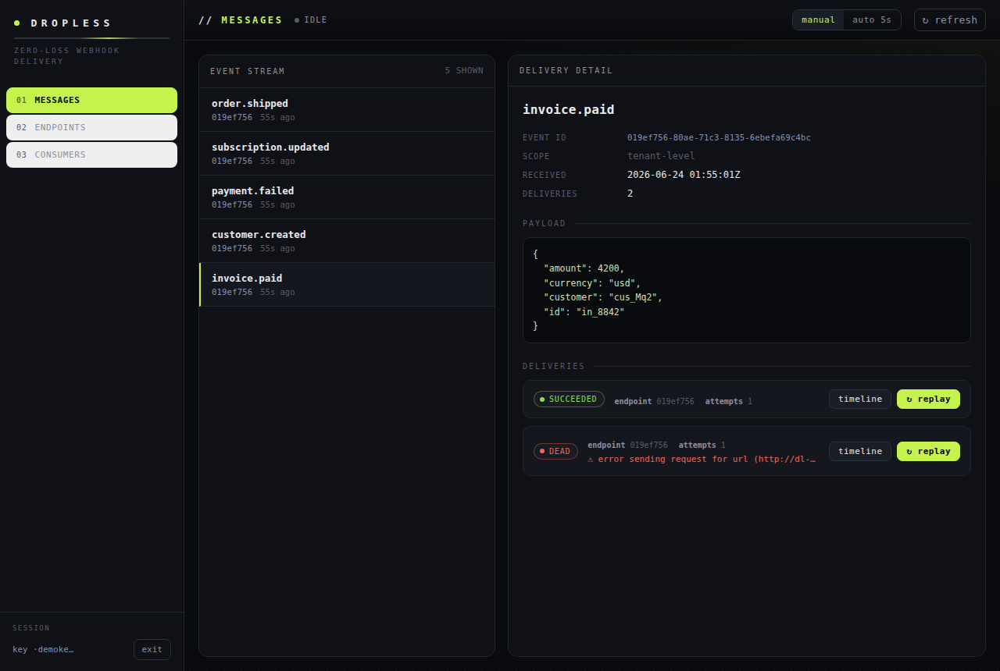

<div align="center">

# Dropless

**Webhooks that never drop. Self-hostable, Postgres-only, AGPL-3.0.**

[](https://github.com/r4nd0mENRYU/dropless/actions/workflows/ci.yml)
[](./LICENSE)


Receive webhooks (Stripe, GitHub, …) without losing them, and fan them back out
to your subscribers — durably, with retries, HMAC signatures, replay, and a
built-in dashboard — from a single `docker compose up`. No Redis, no Kafka, no
queue to operate. Just Postgres.

<br>



</div>

---

## Why

The hard part of webhooks isn't the `POST`. It's **not losing them** across
crashes, restarts, network blips, and downstream downtime. Most tools are
cloud-only or pull in Redis/queues. Dropless is **self-host-first,
single-dependency, and bidirectional (inbound + outbound)**.

**The invariant:** an event and all its deliveries are written to Postgres in
**one transaction**, and the API returns `2xx` *only after that commit*. A crash
either commits everything or nothing — there is no acknowledged-but-lost event.

> **Honest fine print:** delivery is **at-least-once**, not exactly-once. Every
> request carries an immutable `Idempotency-Key` so subscribers can dedupe. We'd
> rather deliver twice than zero times — and we'll never claim "exactly-once"
> over a network, because that's a lie.

## Features

- **Zero-loss outbox** — event + deliveries committed in one transaction (commit-then-2xx).
- **Reliable dispatch** — `FOR UPDATE SKIP LOCKED` workers, lease + crash recovery, exponential backoff with jitter, per-endpoint **circuit breaker**, **dead-letter** queue, one-click **replay**.
- **Svix-compatible signing** — outbound requests carry `webhook-id` / `webhook-timestamp` / `webhook-signature` (HMAC-SHA256) + `Idempotency-Key`.
- **Inbound gateway** — `POST /ingest/{slug}` verifies Stripe / GitHub / generic-HMAC signatures, persists the raw body **before anything else**, dedupes on the provider's event id, and bridges it into the outbound pipeline.
- **Multi-tenant** — API keys map to tenants; an optional **consumer** tier (tenant → consumer → endpoint) so one customer's events never reach another's.
- **Per-endpoint event subscriptions** — endpoints can subscribe to specific event types (`payment.*`, exact, or all).
- **Built-in dashboard** — a single self-contained page: browse messages, inspect attempt timelines, replay failures, manage endpoints and consumers.
- **Ops-ready** — `/healthz`, `/readyz`, `/metrics` (Prometheus), per-tenant rate limiting, structured logs.
- **One static binary** — `serve --role=all|api|worker`. Scales horizontally on the same Postgres.

## Quickstart

```sh
git clone https://github.com/r4nd0mENRYU/dropless && cd dropless
docker compose up --build          # Postgres + migrate + API/workers
# API + dashboard on http://localhost:8080
```

Prefer a prebuilt image? Each release publishes one to GHCR — no build needed:

```sh
docker pull ghcr.io/r4nd0menryu/dropless:latest
# point it at your own Postgres:
docker run -e DATABASE_URL=postgres://… -p 8080:8080 ghcr.io/r4nd0menryu/dropless serve
```

Create a key + an endpoint and send your first event:

```sh
docker compose exec app dropless create-api-key  --tenant t1 --key dev
docker compose exec app dropless create-endpoint --tenant t1 \
  --url https://your-subscriber.example/hook --secret whsec_dGVzdA==

curl -XPOST localhost:8080/v1/messages \
  -H 'Authorization: Bearer dev' -H 'Content-Type: application/json' \
  -d '{"event_type":"invoice.paid","payload":{"amount":42}}'
# → 201 only AFTER the event + deliveries are committed (the invariant).
```

Open **http://localhost:8080**, paste the key `dev`, and watch the delivery, its
attempt timeline, and replay it. There's a runnable walkthrough in
[`examples/`](./examples).

## API

Full spec: [`openapi.yaml`](./openapi.yaml) (OpenAPI 3.1).

| | |
|---|---|
| `POST /v1/messages` | publish an event (fan out to the tenant's subscribed endpoints) |
| `GET /v1/messages`, `GET /v1/messages/{id}` | list / inspect events + their deliveries |
| `GET /v1/deliveries/{id}` | a delivery with its full attempt timeline |
| `POST /v1/deliveries/{id}/replay` | re-queue a delivery now |
| `POST/GET /v1/endpoints`, `PATCH /v1/endpoints/{id}` | manage subscriber endpoints (secret returned once) |
| `POST/GET /v1/app[/{uid}/…]` | the optional consumer tier |
| `POST /v1/inbound-sources`, `POST /ingest/{slug}` | inbound gateway |
| `/healthz` `/readyz` `/metrics` | ops |

A zero-dependency **TypeScript SDK** (typed client + a Svix-compatible `Webhook`
verifier, cross-checked against the Rust engine with a shared known-answer
vector) lives in [`clients/typescript`](./clients/typescript).

## Architecture

```
producer ──POST /v1/messages──▶  [ one transaction: event + N deliveries ]  ──2xx
                                        │  Postgres = source of truth AND queue
                                        ▼
              workers ──FOR UPDATE SKIP LOCKED──▶ sign (HMAC) ──▶ POST subscriber
                  │   retry · backoff+jitter · circuit breaker · dead-letter · replay
                  ▼
              LISTEN/NOTIFY wakes idle workers; a poll interval catches timed retries
```

Postgres is **both** the source of truth and the queue — no separate broker to
run, back up, or lose data to. Everything uses the runtime-checked sqlx API (no
compile-time `query!` macros) so `cargo build` needs **no database** — that's a
CI gate.

## Proof (the whole point)

```sh
make test-all          # no-loss across a simulated crash (needs DATABASE_URL)
make kill9             # a real kill -9 mid-delivery → drop = 0
make bench             # measured throughput → bench/REPORT.md
```

Both proofs run in [CI](./.github/workflows/ci.yml) on every push.

## Deploying

`docker compose up` builds a small image and brings up Postgres → migrate → app.
In production, **front the server with a TLS-terminating reverse proxy / WAF**
for global rate limiting, timeouts, and slow-loris defense — especially for the
public `/ingest/{slug}` endpoint. Set `METRICS_TOKEN` to gate `/metrics`, and
`RATE_LIMIT_RPS` for per-tenant ingest limits. Inbound signatures are verified in
constant time and replay-deduped on **signed** material; unknown sources and bad
signatures return an identical `401`.

## Contributing

Issues and PRs welcome — see [CONTRIBUTING.md](./CONTRIBUTING.md). The one hard
rule: **no compile-time sqlx macros** (the DB-less build is a CI gate). Security
reports: [SECURITY.md](./SECURITY.md).

## License

[AGPL-3.0](./LICENSE). Open source; if you run a modified version as a network service, you must share your changes. The core stays open — no rug pulls.
